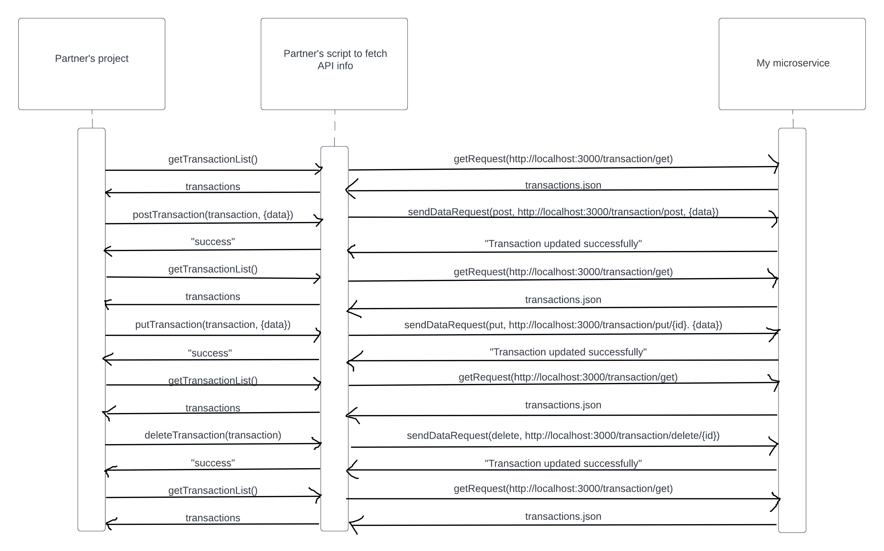

# Transactions RESTful API

In the directory, I have stored three different scripts which effectively perform all the same tasks. These are commands.sh, commands.js, and commands.py and they incude the relevant helper functions and calls to GET, POST, PUT, and DELETE data from the transactions.json file, which ultimately stores all transactions that the user inputs.

## Instructions on how to programmatically REQUEST data

*Uses the /transaction/get URL*

To request data, all you have to do is call the "http://localhost:3000/transaction/get" URL and it will respond back with the entire output of the transactions.json file stored on the site's server-side backend.

### Example call on requesting data

There are three main ways to request data, you can either use the curl command on the command line, server-side JavaScript, or with Pyton's Flask framework to request data.

1. Using the command line:

Note: This method uses the curl command line tool. If you need to download it, I recommend looking up curl installation for your operating system since it varies a lot.

```
curl -X GET http://localhost:3000/transaction/get;
```

2. Using sever-side JavaScript (node.js):

Note: This method uses the axios npm library, which can be installed with `npm install axios`.

Helper function:
```
const getRequest = async (url) => {
    console.log(`\nPerforming GET request to ${url}\n`);
    try {
        const response = await axios.get(url);
        console.log(response.data);
    } catch (error) {
        console.error(`Error: ${error}`);
    }
}
```

Call:
```
await getRequest('http://localhost:3000/transaction/get')
```

3. Using Python's Flask framework:

Helper function:
```
def getRequest(url):
    print(f"Making GET request to {url}")
    response = requests.get(url)
    print(response.text)
```

Call:
```
getRequest('http://localhost:3000/transaction/get')
```

## Instructions on how to programmatically POST data

*Uses the /transaction/post URL*

To post data, all you have to do is call the "http://localhost:3000/transaction/post" URL with the id, amount, and description parameters filled out and it will make the relevant changes into the transactions.json file. To view the changes, you must fetch the data with GET.

### Example call on posting data

There are three main ways to post data, you can either use the curl command on the command line, server-side JavaScript, or with Pyton's Flask framework to post data.

1. Using the command line:

Note: This method uses the curl command line tool. If you need to download it, I recommend looking up curl installation for your operating system since it varies a lot.

```
curl -X POST http://localhost:3000/transaction/post -H "Content-Type: application/json" -d '{"id": 1, "amount": 100, "description": "Test transaction"}';
```

2. Using server-side JavaScript (node.js):

Note: This method uses the axios npm library, which can be installed with `npm install axios`.

Helper function:
```
const sendDataRequest = async (method, url, data) => {
    console.log(`\nPerforming ${method.toUpperCase()} request to ${url}\n`);
    try {
        const response = await axios({ method, url, data, headers: {'Content-Type': 'application/json'} });
        console.log(response.data);
    } catch (error) {
        console.error(`Error: ${error}`);
    }
}
```

Call:
```
await sendDataRequest('post', 'http://localhost:3000/transaction/post', { id: 1, amount: 100, description: 'Test transaction' })
```

3. Using Python's Flask framework:

Helper function:
```
def sendDataRequest(method, url, data):
    print(f"Making {method} request to {url}")
    response = requests.request(method, url, json=data)
    print(response.text)
```

Call:
```
sendDataRequest('post', 'http://localhost:3000/transaction/post', {'id': 1, 'amount': 100, 'description': 'Test transaction'})
```

## Instructions on how to programmatically UPDATE data

*Uses the /transaction/put/:id URL*

To update data, all you have to do is call the "http://localhost:3000/transaction/put/:id" URL, where :id is an id in transactions.json that already exists (i.e. for an id of 1, I would call http://localhost:3000/transaction/put/1) with the id, amount, and description parameters filled out and it will make the relevant changes into the transactions.json file. To view the changes, you must fetch the data with GET.

### Example call on updating data

There are three main ways to update data, you can either use the curl command on the command line, server-side JavaScript, or with Pyton's Flask framework to update data.

1. Using the command line:

Note: This method uses the curl command line tool. If you need to download it, I recommend looking up curl installation for your operating system since it varies a lot.

```
curl -X PUT http://localhost:3000/transaction/put/1 -H "Content-Type: application/json" -d '{"amount": 200, "description": "Updated transaction"}';
```

2. Using server-side JavaScript (node.js):

Note: This method uses the axios npm library, which can be installed with `npm install axios`.

Helper function:
```
const sendDataRequest = async (method, url, data) => {
    console.log(`\nPerforming ${method.toUpperCase()} request to ${url}\n`);
    try {
        const response = await axios({ method, url, data, headers: {'Content-Type': 'application/json'} });
        console.log(response.data);
    } catch (error) {
        console.error(`Error: ${error}`);
    }
}
```

Call:
```
await sendDataRequest('put', 'http://localhost:3000/transaction/put/1', { amount: 200, description: 'Updated transaction' })
```

3. Using Python's Flask framework:

Helper function:
```
def sendDataRequest(method, url, data):
    print(f"Making {method} request to {url}")
    response = requests.request(method, url, json=data)
    print(response.text)
```

Call:
```
sendDataRequest('put', 'http://localhost:3000/transaction/put/1', {'amount': 200, 'description': 'Updated transaction'})
```

## Instructions on how to programmatically DELETE data

*Uses the /transaction/delete/:id URL*

To delete data, all you have to do is call the "http://localhost:3000/transaction/put/:id" URL, where :id is an id in transactions.json that already exists (i.e. for an id of 1, I would call http://localhost:3000/transaction/put/1) and it will make the relevant changes into the transactions.json file. To view the changes, you must fetch the data with GET.

### Example call on deleting data

There are three main ways to delete data, you can either use the curl command on the command line, server-side JavaScript, or with Pyton's Flask framework to delete data.

1. Using the command line:

Note: This method uses the curl command line tool. If you need to download it, I recommend looking up curl installation for your operating system since it varies a lot.

```
curl -X DELETE http://localhost:3000/transaction/delete/1;
```

2. Using server-side JavaScript (node.js):

Note: This method uses the axios npm library, which can be installed with `npm install axios`.

Helper function:
```
const sendDataRequest = async (method, url, data) => {
    console.log(`\nPerforming ${method.toUpperCase()} request to ${url}\n`);
    try {
        const response = await axios({ method, url, data, headers: {'Content-Type': 'application/json'} });
        console.log(response.data);
    } catch (error) {
        console.error(`Error: ${error}`);
    }
}
```

Call:
```
await sendDataRequest('delete', 'http://localhost:3000/transaction/delete/1')
```

3. Using Python's Flask framework:

Helper function:
```
def sendDataRequest(method, url, data):
    print(f"Making {method} request to {url}")
    response = requests.request(method, url, json=data)
    print(response.text)
```

Call:
```
sendDataRequest('delete', 'http://localhost:3000/transaction/delete/1', {})
```

## Instructions on how to programmatically RECEIVE data

Because the data with the GET functionality is already returned upon every request, I will focus this section on how one might get the data (which by default is outputted to the console or standard out) and then read from it. My recommended approach will be to store the output in either a variable or in a file. From there, my partner can either use the variable where ever they want or they could read and parse the file.

1. Step one involves how one would store the output of the GET request into a file with the command line. To do so, all you need to do is add a ```> <outputFileName>``` at the end.

For example, 
```
curl -X GET http://localhost:3000/transaction/get > outputfile.txt
```
or
```
./commands.sh > outputfile.txt
```

2. Step two involves how one would store the output of the GET request into a file or variable with server-side JavaScript. To store as a file, you can simply import fs and then modify the getRequest function I provided in the commands.js file. To store as a variable, you can simply modify the getRequest function and change the call a bit.

For example, to store in a file:
```
const fs = require('fs')
...
const getRequest = async (url) => {
    console.log(`\nPerforming GET request to ${url}\n`)
    try {
        const response = await axios.get(url)
        console.log(response.data)
        fs.writeFileSync('output.txt', JSON.stringify(response.data) + '\n', { flag: 'a' })
    } catch (error) {
        console.error(`Error: ${error}`)
    }
}
```
or to store in a variable:
```
const getRequest = async (url) => {
    console.log(`\nPerforming GET request to ${url}\n`)
    try {
        const response = await axios.get(url)
        console.log(response.data)
        return response.data
    } catch (error) {
        console.error(`Error: ${error}`)
        return null
    }
}
...
const data1 = await getRequest('http://localhost:3000/transaction/get')
```

3. Step three involves how one would store the output of the GET request into a file or variable with Python's Flask framework. To store as a file, you can simply edit the get_request function I provided in the commands.py file. To store as a variable, you can simply modify the getRequest function and change the call a bit.

For example, to store in a file:
```
def getRequest(url):
    print(f"Performing GET request to {url}")
    response = requests.get(url)
    print(response.text)

    with open('output.txt', 'w') as file:
        file.write(response.text + '\n')
```
or to store in a variable:
```
def getRequest(url):
    print(f"Performing GET request to {url}")
    try:
        response = requests.get(url)
        print(response.text)
        return response.text
    except requests.RequestException as error:
        print(f"Error: {error}")
        return None
...
data1 = getRequest('http://localhost:3000/transaction/get')
```

## UML Diagram



Note: I included 3 main objects instead of 2 because I was basing it off of my partner's code, the script I wrote to test my microservice, and my microservice. Moreover, while the script/function for getting information from my microservice does not need to be it's own entity, I highly recommend that it is because abstracting the individual details out and having functions or helper functions will help to maintain the readability of the code.
